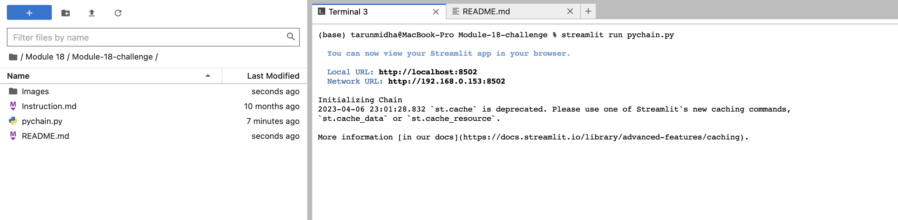
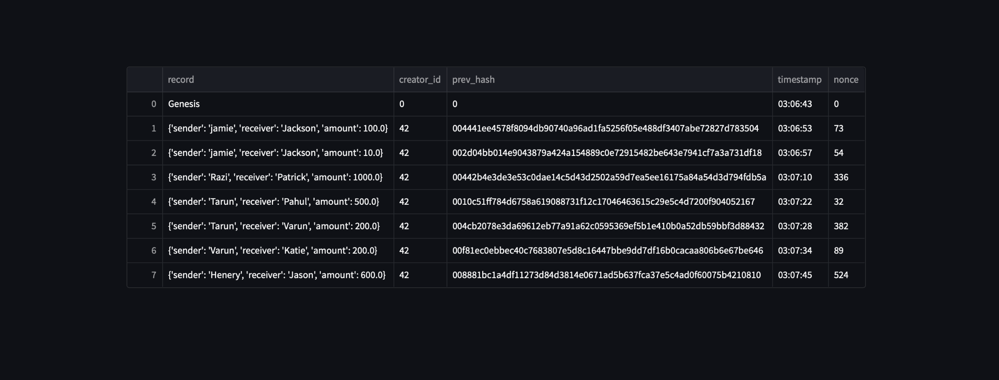
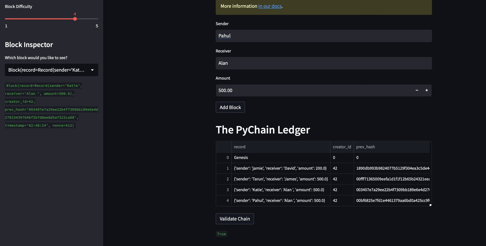
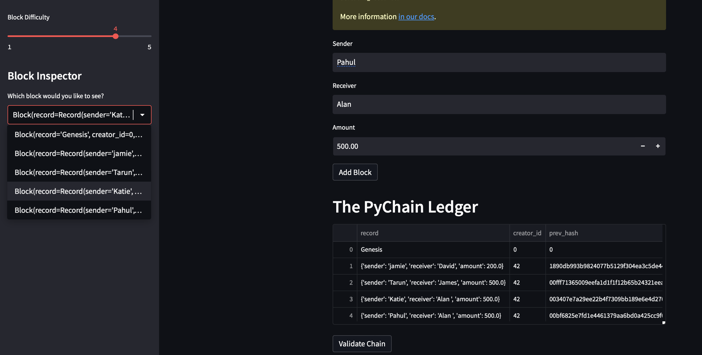
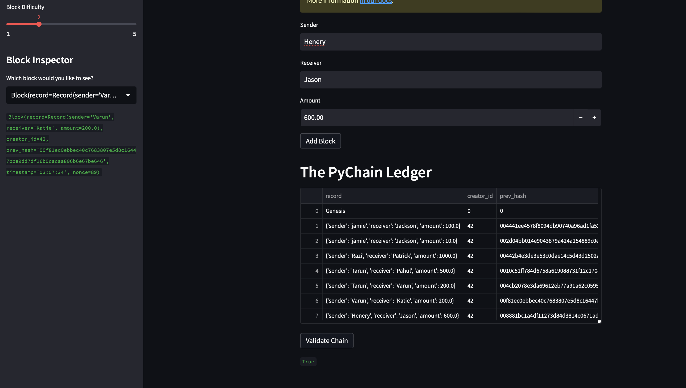

## Test your complete PyChain ledger and user interface

1. **Run your Streamlit application** by navigating to the project folder where you've coded this assignment and using the command `streamlit run pychain.py` in the terminal.

2. **Enter values for the sender, receiver, and amount**, and then click the *Add Block* button. Do this several times to store several blocks in the ledger.

3. **Verify the block contents and hashes** in the Streamlit dropdown menu. Take a screenshot of the Streamlit application page, which should detail a blockchain that consists of multiple blocks. Include the screenshot in the `README.md` file for your GitHub repository.

4. **Test the blockchain validation process** by using the web interface. Take a screenshot of the Streamlit application page, which should indicate the validity of the blockchain. Include the screenshot in the `README.md` file for your homework repository.

